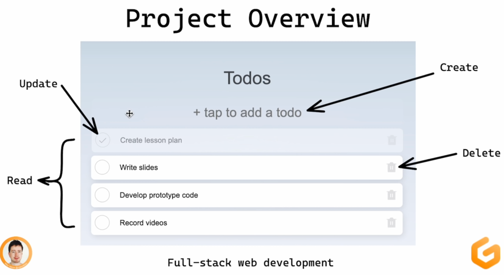
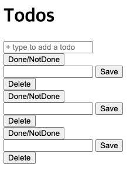
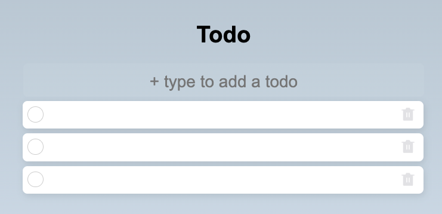

# [스벨트 풀스택 입문 강의 - todo app 만들기](https://www.youtube.com/watch?v=OUzaUJ3gEug&t=828s)
github: https://github.com/gitpod-io/full-stack-web-development

## (1:32:07) Develop HTML structure
- src/app.html
```html
<head> %sveltekit.head% </head>
```
    - 자동으로 sveltekit의 head생성
- src/routes/page.svelte
```html
<script>
  import TodoItem from "$lib/todo-item.svelte";
  const title = "Todo";
</script>

<svelte:head>
  <title>{title}</title>
</svelte:head>
```
    - script로 스벨트 컴포넌트 추가하기. 
    - script로 변수/상수 추가하기.
    - html에서 { } 으로 script에서 사용한 변수/상수 사용하기.
    - <svelte:head> 으로 head 수정하기


## (1:53:46) Apply CSS styles
- 추가 공부: 스벨트에서의 라우팅
  - +page.svelte를 index.svelte로 바꾸자 오류떴다.
  - 강의를 보고 __layout.svelte파일을 추가했는데, 전체 페이지에 반영되지 않았다.
  - 최신 버전에서는 +page가 index를, +layout이 __layout을 의미했다!
  - 공식문서: https://kit.svelte.dev/docs/routing#layout
    - 각 page는 독립적인 컴포넌트이다.
    - `+layout.svelte` 많은 앱에는 최상위 탐색이나 바닥글과 같이 모든 페이지에 표시되어야하는 요소가 있다. 이러한 요소를 모든 page에서 반복하는 대신 레이아웃에 넣을 수 있다.
      - <slot></slot>으로 routes내 페이지들에 레이아웃을 적용 할 수 있다.
- Todo를 추가할 때만 저장 아이콘이 보이도록 하는 방법 배움. (lib/todo-item.svelte)


##  (2:44:32) Develop CRUD endpoints: GET and POST
- 추가 공부: endpoint -> +server.js
  - 공식문서 https://kit.svelte.dev/docs/routing#server