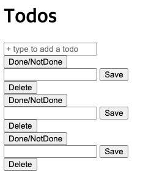

# [스벨트 풀스택 입문 강의 - todo app 만들기](https://www.youtube.com/watch?v=OUzaUJ3gEug&t=828s)

## (1:32:07) Develop HTML structure
- src/app.html 
```html
<head> %sveltekit.head% </head>
```
    - 자동으로 sveltekit의 head생성
- src/routes/page.svelte
```html
<script>
    import TodoItem from "$lib/todo-item.svelte";
    const title = "Todo";
</script>

<svelte:head>
    <title>{title}</title>
</svelte:head>
```
    - script로 스벨트 컴포넌트 추가하기. 
    - script로 변수/상수 추가하기.
    - html에서 { } 으로 script에서 사용한 변수/상수 사용하기.
    - <svelte:head> 으로 head 수정하기


## (1:53:46) Apply CSS styles